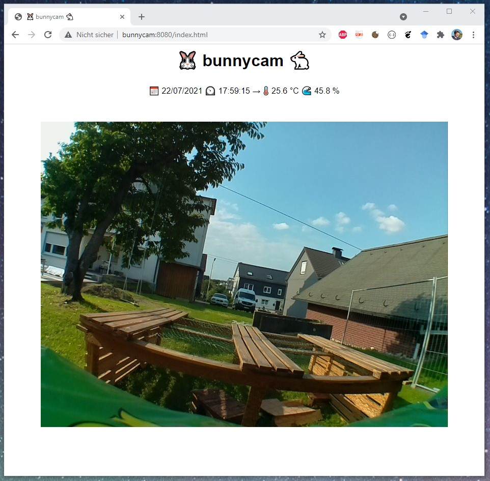
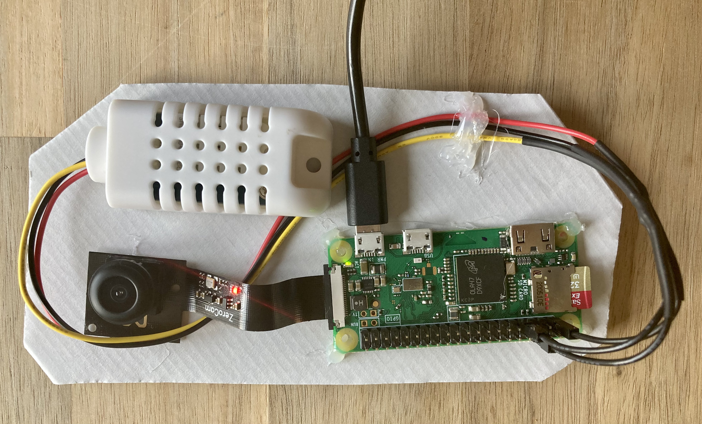

# bunnycam
Raspberry PI Zero W Camera and a simple http server with stream and some weather-data for outdoor bunnys (Edgar and Puffy):



## Parts

* **Board:** RASP PI ZERO W Raspberry Pi Zero W ([Reichelt](https://www.reichelt.de/raspberry-pi-zero-w-v-1-1-1-ghz-512-mb-ram-wlan-bt-rasp-pi-zero-w-p256438.html?&nbc=1))
* **Camera:** RPIZ CAM 5MP 170 Raspberry Pi Zero ([Reichelt](https://www.reichelt.de/raspberry-pi-zero-kamera-fuer-raspberry-pi-zero-5mp-170-ov5-rpiz-cam-5mp-170-p242690.html?&nbc=1))
* **Sensor:** AM2302 / DH / DEBO DHT 22 WIRE ([Reichelt](https://www.reichelt.de/entwicklerboards-temperatur-feuchtigkeitssensor-am2302-dh-debo-dht-22-wire-p266035.html?&nbc=1))
* **And also:** 
    * SD-Card for the raspberry
    * powersupply or powerbank 
    * a cable with micro-usb for power to the raspberry

## Build

Connect all the parts: 
* Camera to the raspberry
* Sensor to the raspberry (black = any ground pin, red = any 3,3v pin, data = pin GPIO 4), see [raspberry pi zero pinout](https://duckduckgo.com/?q=raspberry+pi+zero+pinout&t=h_&iax=images&ia=images)
* Build a or use a nice housing for the componets. I used a cardboard and some hotglue for development and testing:



## Install

1. Setup Raspberry PI Zero w with current raspian and login via ssh. 
2. First, get updates: 
    ```
    sudo apt-get update
    sudo apt-get upgrade
    sudo apt-get dist-update
    sudo apt-get autoremove
    sudo apt-get autoclean 
    ```

3. Reboot:
    ```sudo reboot```

4. Open system settings with  ``   sudo raspi-config`` and change...
     - Enable camera
     - Change password
     - Set hostname
     - Set timezone
     - Set WLAN country
     - Expand filesystem

5. Reboot:
    ``sudo reboot  ``    

6. Install tools: 
    ```
    sudo apt-get install fish mc git python-picamera python3-picamera python3-pip libgpiod2
    sudo pip3 install --upgrade setuptools
    pip3 install adafruit-circuitpython-dht 
    ```

7. Clone git repository https://github.com/haenno/bunnycam to home folder: 
    ``` 
    cd ~
    git clone git@github.com:haenno/bunnycam.git
    ```

    Maybe you need to first create new ssh key with  ``ssh-keygen -t ed25519 -C "your_email@adress.com"`` and add it to your github account.

8. Setup bunnycam webserver and logging als systemd deamons:

    ```
    sudo cp /home/pi/bunnycam/bunnycamlog.service /etc/systemd/system
    sudo cp /home/pi/bunnycam/bunnycamwww.service /etc/systemd/system 
    sudo systemctl daemon-reload
    sudo systemctl enable bunnycamwww
    sudo systemctl enable bunnycamlog
    ```
9. Get crontab to grab updates...

    Open crontab with ``sudo crontab -e`` and insert 1 line: 
    ```
    0 4 * * * date >> /var/log/bunnycamsys.log && vcgencmd measure_temp >>  /var/log/bunnycamsys.log  && apt-get update -yq >>  /var/log/bunnycamsys.log && apt-get upgrade -yq >>  /var/log/bunnycamsys.log  && apt-get dist-upgrade -yq >>  /var/log/bunnycamsys.log
    ```
    So it will check for system update every day at 04:00. 

10. Try to open the stream:
    Open your browser and type ``http://`` in the adressfield, followed by the hostname or ip of your raspberry and the port ``:8080``.
    I my case the hostname was "bunnycam", so the url was: ``http://bunnycam:8080``  

## Todo

* Build better caseing.
* Add WLAN antenna.
* Update pip3 with crontab.
* Self check if network / system is running. Reboot if not.
* Send logs / status via email.
* Save some of the images (for timelaps?).
* Add a led stripe and control via http.
